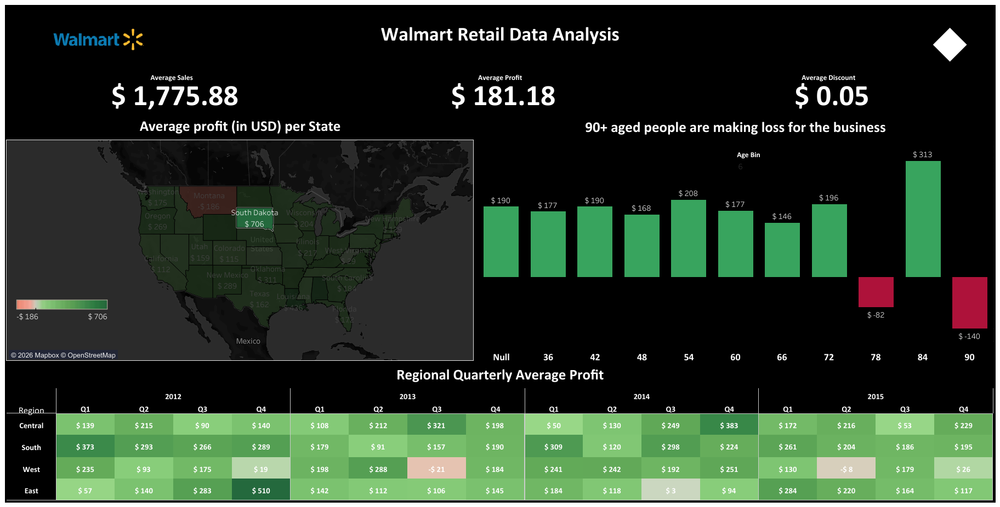

# 🛒 Walmart Retail Data Analysis (Tableau)

A data analysis project focused on exploratory analysis, profitability modeling, and regional performance evaluation using Walmart retail transaction data. The project leverages Tableau to build an interactive dashboard that highlights business-critical KPIs and profitability drivers.

---

## 📌 Objective

To analyze Walmart retail sales data and identify:

- Key profit drivers  
- Underperforming customer segments  
- Regional and state-level performance differences  
- Quarterly profit trends  
- Impact of discounts on profitability  

The goal was to translate transactional data into measurable business insights.

---

## 📂 Dataset

- File: `walmart Retail Data.csv`
- Format: CSV
- Granularity: Transaction-level retail data
- Key fields:
  - Sales
  - Profit
  - Discount
  - Region
  - State
  - Order Date
  - Customer Age Group (Binned)

---

## 🧹 Data Preparation

Performed the following steps before visualization:

- Validated numeric fields (Sales, Profit, Discount)
- Checked for missing or null values
- Created calculated measures:
  - **Average Sales**
  - **Average Profit**
  - **Average Discount**
  - **Quarter-Year extraction from Order Date**
- Built age bins for segmentation analysis
- Aggregated profit by:
  - State
  - Region
  - Quarter
  - Customer Age Group

---

## 📊 Dashboard Preview

---

## 🔗 Live Dashboard

👉 https://public.tableau.com/app/profile/akshayparulekar/viz/WalmartRetailDataAnalysis_16496912054700/WallmartRetailDataAnalysis

---

## 📈 Analytical Components

### 1️⃣ KPI Layer
- Average Sales: $1,775.88  
- Average Profit: $181.18  
- Average Discount: $0.05  

These metrics provide a top-level performance summary.

---

### 2️⃣ Geographic Profit Analysis
- State-level profit distribution using a filled map
- Identified high-profit vs low-profit states
- Enabled spatial comparison across the US

Analytical focus: Detecting geographic concentration of profit variability.

---

### 3️⃣ Age Segment Profitability

- Aggregated profit by age bin
- Identified negative profit in 90+ segment
- Highlighted customer segments contributing to loss

Analytical question addressed:  
Is profitability consistent across demographic groups?

---

### 4️⃣ Regional Quarterly Trend Analysis

- Built a heatmap showing average profit by:
  - Region
  - Quarter
  - Year
- Enabled time-series comparison
- Identified seasonal and regional volatility

Analytical focus:  
Understanding cyclical profit patterns and regional stability.

---

## 📐 Key Insights

- Profit distribution is uneven across states, indicating regional optimization opportunities.
- Certain demographic segments generate negative margins, suggesting pricing or discount inefficiencies.
- Quarterly performance fluctuates significantly by region, indicating possible seasonality effects.
- Discount levels may not consistently translate into higher profitability.

---

## 🛠 Tools & Techniques

- Tableau Public
- Data aggregation and calculated fields
- Geographic mapping
- Time-series analysis
- Heatmap visualization
- KPI dashboard design principles

---

## 📊 Business Implications

- Refine discount strategies for low-margin segments  
- Reassess customer targeting for loss-generating age groups  
- Optimize regional sales strategy based on seasonal performance  
- Support data-driven executive decision-making  

---

## 🚀 Skills Demonstrated

- Exploratory Data Analysis (EDA)
- Data Cleaning & Transformation
- Business KPI Development
- Data Aggregation & Segmentation
- Profitability Analysis
- Visual Analytics & Dashboard Design
- Insight Communication
